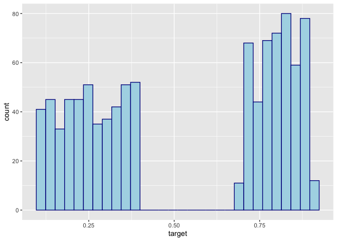
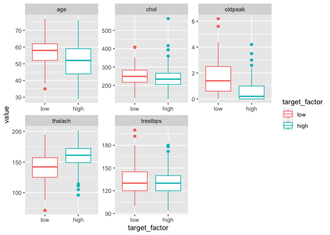
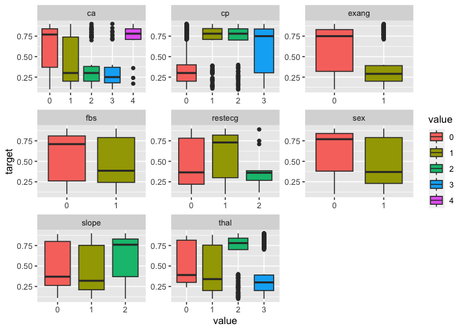
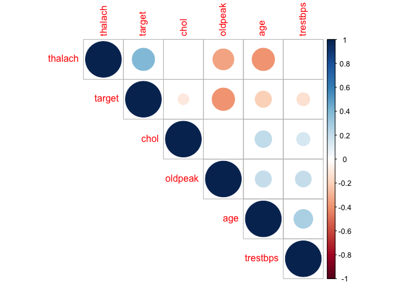

Heart Attack Visualisation
================

Challenge: What key variables relate to low versus high risk of heart
attack.

## Load in data and packages

``` r
library(dplyr)
library(tibble)
library(tidyr)
library(ggplot2)
library(ggpubr)
library(wesanderson)
library(GGally)
library(tableone)
library(corrplot)

df <- read.csv("/Users/rebecca/Desktop/heart.csv")
# Print first 10 lines to see data and columns
head(df, 10)
```

    ##    age sex cp trestbps chol fbs restecg thalach exang oldpeak slope ca thal
    ## 1   52   1  0      125  212   0       1     168     0     1.0     2  2    3
    ## 2   53   1  0      140  203   1       0     155     1     3.1     0  0    3
    ## 3   70   1  0      145  174   0       1     125     1     2.6     0  0    3
    ## 4   61   1  0      148  203   0       1     161     0     0.0     2  1    3
    ## 5   62   0  0      138  294   1       1     106     0     1.9     1  3    2
    ## 6   58   0  0      100  248   0       0     122     0     1.0     1  0    2
    ## 7   58   1  0      114  318   0       2     140     0     4.4     0  3    1
    ## 8   55   1  0      160  289   0       0     145     1     0.8     1  1    3
    ## 9   46   1  0      120  249   0       0     144     0     0.8     2  0    3
    ## 10  54   1  0      122  286   0       0     116     1     3.2     1  2    2
    ##    target
    ## 1    0.23
    ## 2    0.37
    ## 3    0.24
    ## 4    0.28
    ## 5    0.21
    ## 6    0.78
    ## 7    0.37
    ## 8    0.17
    ## 9    0.25
    ## 10   0.23

## Data Description:

- Age: Numeric (e.g., 52)
- Sex: Categorical (0: Female, 1: Male)
- Chest Pain Type: Categorical (0: Typical Angina, 1: Atypical Angina,
  2: Non-anginal Pain, 3: Asymptomatic)
- Resting Blood Pressure: Numeric (e.g., 125)
- Serum Cholesterol: Numeric in mg/dL (e.g., 212)
- Fasting Blood Sugar: Categorical (0: \<= 120 mg/dL, 1: \> 120 mg/dL)
- Resting Electrocardiographic Results: Categorical (0: Normal, 1:
  Abnormality, 2: Hypertrophy)
- Maximum Heart Rate Achieved: Numeric (e.g., 168)
- Exercise-Induced Angina: Categorical (0: No, 1: Yes)
- Oldpeak (ST Depression): Numeric (e.g., 1.0)
- Slope of Peak Exercise ST Segment: Categorical (0: Upsloping, 1: Flat,
  2: Downsloping)
- Number of Major Vessels Colored by Fluoroscopy: Numeric (0 to 3)
- Thalassemia: Categorical (0: Normal, 1: Fixed Defect, 2: Reversible
  Defect)

Key outcome: - “Target”: the percentage of heart attack risk in
patients.

## Data Cleaning:

``` r
# Edit data types e.g. sex as categorical
cols <- c("sex", "cp", "fbs", "restecg", "exang", "slope", "ca", "thal")
df[,cols] <- lapply(df[,cols], factor) 

# Check for missing data:
miss <- sum(is.na(df))
sprintf("Number of missing datapoints: %i", miss)
```

    ## [1] "Number of missing datapoints: 0"

``` r
# Check for duplicate rows & remove
dup <- sum(duplicated.data.frame(df))
sprintf("Number of duplicated rows: %i", dup)
```

    ## [1] "Number of duplicated rows: 55"

``` r
if(dup > 0){
  df <- distinct(df)
}
```

# Summary Statistics

``` r
CreateTableOne(data=df, factorVars = cols)
```

    ##                       
    ##                        Overall       
    ##   n                       970        
    ##   age (mean (SD))       54.40 (9.11) 
    ##   sex = 1 (%)             675 (69.6) 
    ##   cp (%)                             
    ##      0                    470 (48.5) 
    ##      1                    156 (16.1) 
    ##      2                    270 (27.8) 
    ##      3                     74 ( 7.6) 
    ##   trestbps (mean (SD)) 131.72 (17.58)
    ##   chol (mean (SD))     245.65 (51.77)
    ##   fbs = 1 (%)             146 (15.1) 
    ##   restecg (%)                        
    ##      0                    464 (47.8) 
    ##      1                    492 (50.7) 
    ##      2                     14 ( 1.4) 
    ##   thalach (mean (SD))  149.11 (23.11)
    ##   exang = 1 (%)           326 (33.6) 
    ##   oldpeak (mean (SD))    1.07 (1.18) 
    ##   slope (%)                          
    ##      0                     70 ( 7.2) 
    ##      1                    456 (47.0) 
    ##      2                    444 (45.8) 
    ##   ca (%)                             
    ##      0                    543 (56.0) 
    ##      1                    218 (22.5) 
    ##      2                    125 (12.9) 
    ##      3                     67 ( 6.9) 
    ##      4                     17 ( 1.8) 
    ##   thal (%)                           
    ##      0                      7 ( 0.7) 
    ##      1                     59 ( 6.1) 
    ##      2                    506 (52.2) 
    ##      3                    398 (41.0) 
    ##   target (mean (SD))     0.53 (0.29)

``` r
# Plot Target as histogram
ggplot(data=df, aes(x=target))+
  geom_histogram(color="darkblue", fill="lightblue")
```

    ## `stat_bin()` using `bins = 30`. Pick better value with `binwidth`.

<!-- -->

``` r
# Clear grouping of 'high' and 'low' risk groups for heart attack 
df$target_factor <- factor(ifelse(df$target <0.5, 'low', 'high'), levels=c('low','high')) 
```

## Plot continuous and categorical variables and how they relate to target

``` r
# How does each continuous variable relate to 'target_factor'
contin <- c("age", "trestbps", "chol", "thalach", "oldpeak")
df[,c(contin, "target_factor")] %>%
  gather(-target_factor, key = "var", value = "value") %>%
  ggplot(aes(y = value, x = target_factor, color= target_factor)) +
    geom_boxplot() +
    facet_wrap(~ var, scales = "free")
```

<!-- -->

``` r
# How does each categorical variable relate to 'target'
df[,c(cols, "target")] %>%
  gather(-target, key = "var", value = "value") %>%
  ggplot(aes(x = value, y = target, group= value, fill=value)) +
    geom_boxplot() +
    facet_wrap(~ var, scales = "free")
```

    ## Warning: attributes are not identical across measure variables;
    ## they will be dropped

<!-- -->

## Correlation plot between all variables and target outcome

``` r
# mat : is a matrix of data
# ... : further arguments to pass to the native R cor.test function
cor.mtest <- function(mat, ...) {
    mat <- as.matrix(mat)
    n <- ncol(mat)
    p.mat<- matrix(NA, n, n)
    diag(p.mat) <- 0
    for (i in 1:(n - 1)) {
        for (j in (i + 1):n) {
            tmp <- cor.test(mat[, i], mat[, j], ...)
            p.mat[i, j] <- p.mat[j, i] <- tmp$p.value
        }
    }
  colnames(p.mat) <- rownames(p.mat) <- colnames(mat)
  p.mat
}
# matrix of the p-value of the correlation
M <- cor(df[,c(contin, "target")])
p.mat <- cor.mtest(df[,c(contin, "target")])

# Leave blank on no significant coefficient
corrplot(M, type="upper", order="hclust", 
         p.mat = p.mat, sig.level = 0.01, insig = "blank")
```

<!-- -->

# Which of these are significantly related to low/high risk groups?

## Statistical Tests

``` r
# For continuous data, perform a t-test between low and high risk groups
stat1 = data.frame(matrix(ncol = 4, nrow = length(contin)))
colnames(stat1) <- c("Var", "Test", "Test_Stat", "p")
stat1$Var <- contin
stat1$Test <- "t-test"

for (i in 1:length(contin)){
  var <- contin[i]
  test <- t.test(df[,var] ~ df$target_factor)
  stat1$Test_Stat[i] <- test$statistic
  stat1$p[i] <- test$p.value
}

# For categorical data, use a chi-square test 
stat2 = data.frame(matrix(ncol = 4, nrow = length(cols)))
colnames(stat2) <- c("Var", "Test", "Test_Stat", "p")
stat2$Var <- cols
stat2$Test <- "chi-sq"

for (i in 1:length(cols)){
  var <- cols[i]
  test <- chisq.test(df[,var], df$target_factor, correct=FALSE)
  stat2$Test_Stat[i] <- test$statistic
  stat2$p[i] <- test$p.value
}
```

    ## Warning in chisq.test(df[, var], df$target_factor, correct = FALSE): Chi-squared
    ## approximation may be incorrect

``` r
# Combined these two tables and add fdr-correction for number of tests being performed, and add significance indicator
stat3 <- rbind(stat1, stat2)
stat3$p_fdr <- p.adjust(stat3$p, method="fdr")
stat3$sig <- cut(stat3$p_fdr, breaks = c(0, 0.001, 0.01, 0.05, 0.1, 1), include.lowest = T, labels = c('***', '**', '*', '.', ''))
stat3
```

    ##         Var   Test  Test_Stat            p        p_fdr sig
    ## 1       age t-test   7.135170 1.927203e-12 2.783738e-12 ***
    ## 2  trestbps t-test   4.392933 1.245446e-05 1.471890e-05 ***
    ## 3      chol t-test   3.126699 1.820696e-03 1.972420e-03  **
    ## 4   thalach t-test -14.111755 3.851016e-41 8.343868e-41 ***
    ## 5   oldpeak t-test  14.936495 1.708431e-44 5.552401e-44 ***
    ## 6       sex chi-sq  72.683768 1.521806e-17 2.472935e-17 ***
    ## 7        cp chi-sq 269.555212 3.852083e-58 2.503854e-57 ***
    ## 8       fbs chi-sq   1.241740 2.651359e-01 2.651359e-01    
    ## 9   restecg chi-sq  34.220943 3.706949e-08 4.819034e-08 ***
    ## 10    exang chi-sq 191.157563 1.776904e-43 4.619952e-43 ***
    ## 11    slope chi-sq 145.310307 2.794267e-32 5.189352e-32 ***
    ## 12       ca chi-sq 229.916939 1.375541e-48 5.960678e-48 ***
    ## 13     thal chi-sq 270.062800 2.991437e-58 2.503854e-57 ***

# Key Takeaways:

- Clear separation between low and high risk patients
- This may be more clinically useful as an indicator, versus absolute
  risk percentage
- All variables, excpet for fasting blood sugar, show significant
  relationships to high versus low risk
- These are viable candidates for a predictive model to determine future
  risk status of patients
